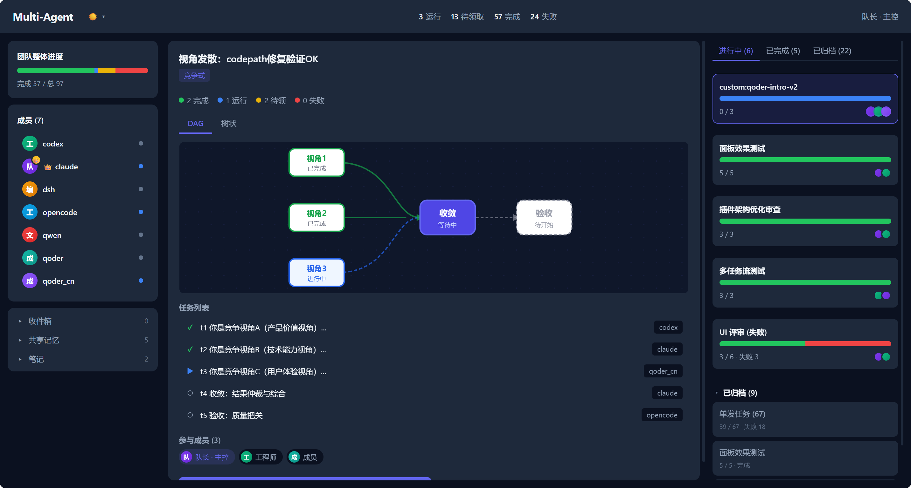
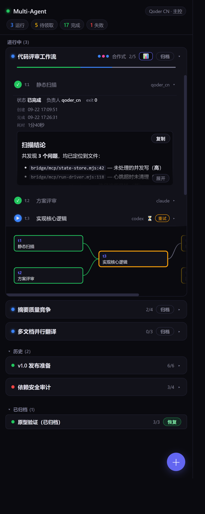
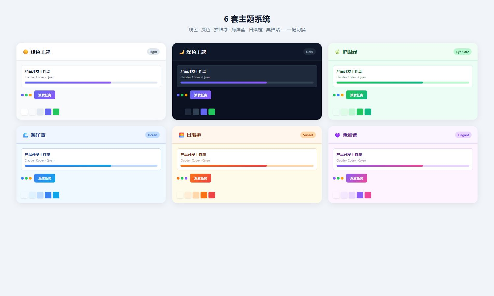

<div align="center">

# Multi-Agent Bridge

**Orchestrate multiple Agent CLIs into a collaborative team — a zero-dependency MCP Server + multi-panel visualization.**

[](LICENSE)
[](#requirements)
[](#why)
[](#what-is-mcp)
[](CHANGELOG.md)

*Task DAG orchestration · Shared memory · Message bus · Multi-panel · Cross-agent collaboration*

</div>

<p align="center">
  
</p>

---

## What

`multi-agent-bridge` is a **multi-agent collaboration system** built around an MCP Server implemented with pure Node.js standard library. It connects independent Agent CLIs — **Claude Code, Codex, Qwen, opencode, DSH** — into a single collaboration network.

They normally work in isolation and never talk to each other. This system gives them shared "public utilities" and a "visual command center":

| Utility | What it solves |
|---------|----------------|
| 🗂️ **Task queue** | Break a big goal into a dependency DAG of tasks, claimed and relayed by multiple Agents |
| 🧠 **Shared memory** | KV store + handoff notes + vector semantic search, so knowledge actually flows between Agents |
| ✉️ **Message bus** | Persistent inbox + real-time wakeup, so Agents can message and signal each other |
| 🖥️ **Multi-panel** | Web console / IDE sidebar / Qoder plugin — three UIs sharing the same component library |

On top of that you get: **429 rate-limit avoidance, parallel multi-worker dispatch, workflow lifecycle management, long-task pause/resume**, and a set of orchestration primitives that make "multiple AIs finishing one goal together" actually work.

## Why

Multi-agent collaboration usually means "writing your own glue code" — stitching shell scripts, gluing databases, hand-rolling polling, manually handling rate limits. This system consolidates all of that into one standardized MCP Server + visualization panels:

- **Zero third-party dependencies**: only Node.js built-in modules (`child_process` / `fs` / `readline` …), `npm install` pulls 0 packages, deploy = copy files.
- **One protocol**: every Agent talks through the same set of MCP tools instead of N private formats.
- **Observable**: task status, heartbeats, stats, and panels — collaboration is no longer a black box.
- **Resilient**: rate limits (429), timeouts, false success, stuck processes — these "long-task realities" are handled by built-in mechanisms.
- **Consistent across platforms**: Web panel, DSH sidebar, Qoder plugin all share the same React component library for a unified experience.

---

## Multi-Panel Ecosystem

<div style="display: flex; gap: 16px; align-items: flex-start; flex-wrap: wrap;">

### 🖥️ Web Console (React)

Full three-column collaboration console, ideal for desktop monitoring and deep operations.

- **Left column**: Task list (Running / Completed / Pending / Archived — segmented sections)
- **Middle column**: Task dependency DAG + task detail panel + dispatch button
- **Right column**: Workflow list (card-based, with progress bars + Agent tags)
- 6 themes: Dark / Light / Eye Care / Ocean / Sunset / Elegant
- Real-time SSE push + polling fallback

### 📋 DSH Panel (IDE Sidebar)

Sidebar panel embedded in DSH editor — compact and efficient, check collaboration status while coding.

<p align="center">
  
</p>

- StickyHeader with connection status + global stats
- Workflow cards (segmented progress bar + task expand + inline DAG view)
- Collapsible Archive / History sections
- FAB button + dispatch overlay
- Shares `bridge-ui` component library with Web panel — consistent experience

### 🔌 Qoder Panel (Qoder CN Plugin)

Panel plugin for Qoder CN IDE — adapted for domestic development environments.

- Built on `bridge-ui` inline style system, bypasses webview CSP restrictions
- Full collaboration features and all 6 themes supported

</div>

---

## Core Features

### 🗂️ Task queue + DAG orchestration
- Tasks carry `deliverable` (artifact path) and `acceptance_criteria`, so downstream Agents never guess "when is it done".
- Supports **dependency DAG**: a task can't be claimed before all its predecessors are terminal.
- Full lifecycle primitives: `claim / complete / fail / supersede / reassign / fork / depend`.
- **Built-in evolution**: auto-swap failed Agent (`fork`), back-insert a missing step (`insert`), redo a completed stage (`rollback`), conditional branching (`branch`) — all guarded server-side (evolution count cap + independent review gate).

### ⚡ Parallel multi-worker dispatch + fallback rerouting
- One goal can be dispatched to ≥2 perspectives in parallel; results converge through **arbitration** (majority-first → expert weighting → LLM arbiter as fallback).
- `agent_invoke` auto-reroutes to an idle fallback worker when the target is busy; the controller never spins or gets crushed by long tasks.
- Three collaboration paradigms one command away: compete / collaborate / dynamic routing.

### 🔁 429 avoidance + model rotation + exponential backoff retry
- On rate-limit / timeout, retries with `Retry-After`-aware exponential backoff (default 2 retries, 3 attempts total).
- **Model rotation pool**: when one model keeps returning 429, auto-switches to fallback models (each Agent has a built-in fallback list) to bypass the single-point rate limit bottleneck.
- **False-success detection**: catches "exit 0 but body is actually an upstream 5xx" and retries instead of mis-failing.

### 🧠 Cross-agent shared memory (KV + notes + vector search)
- **KV store** (`shared_memory_*`): cross-process shared key-value, shared with the `shared-memory` plugin.
- **Handoff notes** (`shared_notes_*`): append-only with timestamp and tag, naturally fitting `handoff:<id>`.
- **Vector semantic search** (`memory_*`): ONNX + sqlite-vec; `memory_search` recalls by *meaning* rather than keywords; memories can be sedimented (`task_sediment`) and promoted (`memory_promote`). Models downloaded on demand, never committed to git.

### ✉️ Message bus (persistent inbox + real-time wakeup)
- Messages persist to disk; FIFO + 60s lease prevents double-processing.
- **Real-time wakeup**: while a receiver is suspended in `inbox_wait`, a sender's message **wakes it immediately** — no polling.
- Supports `topic` grouping, `priority` levels, `memory` auto-sedimentation, and `to="*"` broadcast.

### 🎨 6 Themes + Unified Component Library

<p align="center">
  
</p>

- **bridge-ui**: shared React component library, reused across DSH Panel / Qoder Panel / Web Panel
- 6 themes: Dark / Light / Eye Care / Ocean / Sunset / Elegant
- CSS variable driven, one-click switch, with anti-flash protection

### 🔌 Extensible Agent Registry (plug & play new CLIs)
- **7 Agents out of the box**: Claude Code, Codex, Qwen, opencode, DSH, Qoder, Qoder CN — all with built-in descriptors, zero-config auto-detection.
- **`agent_scan` one-click discovery**: scans all locally installed Agent CLIs, auto-verifies availability, and registers them; missing ones get installation guidance links.
- **Unified abstraction layer**: all Workers are invoked through the same `run_<agent>` / `agent_invoke` interface; orchestration layer doesn't care which CLI is underneath.
- **Easily add new Agents**: adding a new CLI only requires one descriptor in `agents-registry.mjs` (launch command, env mapping, rate-limit strategy, capability tags) — no business code changes needed.
- **Capability tags + smart selection**: each Agent carries `capabilities` tags and `strengths` description; `agent_list` provides selection data, `agent_eval` outputs quality/duration/satisfaction metrics.
- **Auto-shared capabilities**: every newly registered Agent automatically gets the full task queue, shared memory, and message bus — no per-agent integration work.

### ⏱️ Long-task management (interrupt / resume / state machine)
- `task_interrupt`: manually stop a stuck/off-course task (Windows `taskkill /T /F`, Unix `SIGTERM→SIGKILL`), preserving partial output and `session_id`.
- `task_resume`: true resume via `session_id` (context preserved); recoverable from interrupted/failed/superseded.
- Complete state machine: `pending → running → interrupted / escalating / awaiting_approval / completed / failed / superseded`.

---

## Quick Start (3 steps)

> Requirements: Node.js ≥ 18, at least one Agent CLI installed (recommend starting with Claude Code as controller).

### Step 1: Clone

```bash
git clone https://github.com/songzhifei512/multi-agent-bridge.git
cd multi-agent-bridge
```

### Step 2: Configure environment variables

Copy the template and fill in your endpoint and keys (every `<placeholder>` is an example — replace with your own value):

```bash
cp config/env.tmpl .env        # or manually copy to ~/.agents/.env
```

Core `.env` entries (endpoints shown as placeholders — fill in your provider):

```bash
# Controller (required)
ANTHROPIC_BASE_URL=<PROVIDER_ANTHROPIC_BASE_URL>
ANTHROPIC_AUTH_TOKEN=<YOUR_ANTHROPIC_API_KEY>
BRIDGE_CONTROLLER=claude

# Optional workers: OpenAI / Qwen / DSH / opencode (enable as needed)
# OPENAI_BASE_URL=<PROVIDER_OPENAI_BASE_URL>
# OPENAI_API_KEY=<YOUR_OPENAI_API_KEY>
# QWEN_BASE_URL=<PROVIDER_QWEN_BASE_URL>
# QWEN_API_KEY=<YOUR_QWEN_API_KEY>
# DSH_BASE_URL=<PROVIDER_DSH_BASE_URL>
# DSH_API_KEY=<YOUR_DSH_API_KEY>
```

> Full guide: [`public-install/ENV_SETUP.md`](public-install/ENV_SETUP.md), example config: [`public-install/agents-config-example/.env.example`](public-install/agents-config-example/.env.example).

### Step 3: Mount to your MCP client

Register the bridge as an MCP Server in your Agent CLI (templates: `config/claude-mcp-config.json.tmpl` / `config/codex-mcp-config.toml.tmpl`).

For Claude Code, add this to your config:

```json
{
  "mcpServers": {
    "multi-agent-bridge": {
      "command": "node",
      "args": ["/path/to/multi-agent-bridge/bridge/mcp/shared-context-server.mjs"],
      "env": {
        "BRIDGE_WORK_ROOT": "/your/project"
      }
    }
  }
}
```

> Installation wizard is also available (auto-replaces path placeholders and writes config):
> ```bash
> bash launchers/install.sh      # Windows: launchers/install-win.bat
> ```

After mounting, your controller Agent can see and call the entire suite of collaboration tools.

---

## Architecture

```
┌─────────────────────────────────────────────────────────────────┐
│                  You / Controller Agent (Claude Code)            │
│                  Invoking collaboration tools via MCP            │
└──────────────────────────────┬──────────────────────────────────┘
                               │ stdio (MCP)
                               ▼
┌─────────────────────────────────────────────────────────────────┐
│          shared-context-server.mjs  (MCP Server)                 │
│      Pure Node.js stdlib · Zero deps · 59 collaboration tools     │
├───────────────────┬─────────────────┬───────────────────────────┤
│   🗂️ Task Queue    │   🧠 Shared Mem  │      ✉️ Message Bus        │
│   (DAG)           │  KV/notes/vector │   (inbox + realtime wake) │
├───────────────────┴─────────────────┴───────────────────────────┤
│              Worker dispatch (Agent Registry / agent_scan)        │
└───────┬───────────┬───────────┬───────────┬───────────┬───────────┬───────────┐
        ▼           ▼           ▼           ▼           ▼           ▼           ▼
   Claude Code   Codex       Qwen      opencode      DSH        Qoder      Qoder CN
   Reasoning     Batch code  Docs/PPT   Backup/par   Multi-back  Fullstack   Tongyi CN
                               │
                    ┌──────────┴──────────┐
                    ▼                     ▼
          ┌─────────────────┐   ┌─────────────────┐
          │   🌐 Web Panel   │   │  📋 DSH Sidebar  │
          │  (React/Vite)   │   │  (DSH Plugin)   │
          └─────────────────┘   └─────────────────┘
                    │                     │
                    └──────────┬──────────┘
                               ▼
                   ┌──────────────────────┐
                   │  bridge-ui library    │
                   │  (12+ shared comps)    │
                   │  · 6 themes            │
                   │  · Dual style system   │
                   └──────────────────────┘
```

---

## Tool Reference (59 tools · 5 categories)

### 🗂️ Task Orchestration
| Tool | Purpose |
|------|---------|
| `task_create` / `task_list` | Create / query tasks (status/search/sort/pagination/batch ops) |
| `task_claim` / `task_complete` / `task_fail` | Claim / complete / fail lifecycle |
| `task_supersede` / `task_reassign` | Mark superseded / unlock back to pending (safe handoff) |
| `task_approve` | Manual approval gate (blocks downstream after completion) |
| `task_interrupt` / `task_resume` | Interrupt long tasks / resume with session |
| `task_fork` / `task_depend` | Fork subtask / dynamically recompute dependencies |
| `task_escalate` / `task_decide` / `task_heartbeat` | Escalate up / delegate down / milestone heartbeat |
| `task_sediment` | Auto-sediment completed tasks into searchable knowledge |

### 🧠 Shared Memory
| Tool | Purpose |
|------|---------|
| `shared_memory_set` / `get` / `list` | Cross-process shared KV (shared with shared-memory plugin) |
| `shared_notes_append` / `read` | append-only handoff notes (with tags) |
| `memory_add` / `memory_search` | Write / vector semantic search |
| `memory_list` / `memory_delete` / `memory_stats` | Memory library management |
| `memory_promote` | Promote project-level memory to platform/global |

### ✉️ Message Bus
| Tool | Purpose |
|------|---------|
| `bus_send` / `agent_send_message` | Send messages (broadcast `to="*"`, auto-sediment to vector memory) |
| `inbox_read` / `inbox_wait` | Sync read / real-time wakeup read (event-driven, non-blocking) |
| `inbox_ack` | ACK consumption (release 60s lease) |
| `bus_history` | Read-only playback of signal/message stream |

### 🤖 Worker Management
| Tool | Purpose |
|------|---------|
| `run_claude` / `run_codex` / `run_qwen` / `run_dsh` / `run_qoder` / `run_qoder_cn` | Async invoke each CLI Agent (auto rate-limit retry + model rotation) |
| `agent_list` / `agent_invoke` | List registered Agents / dispatch by name (busy-fallback to idle worker) |
| `agent_scan` | Detect all 7 locally installed worker CLIs and mount availability flags |
| `agent_eval` | Per-Agent completion rate / quality / duration / retries / satisfaction (5-dim eval) |
| `run_verify` | LLM-as-judge quality gate (score 0–100 by criteria, with degraded pass) |
| `workflow_plan` / `workflow_start` / `workflow_evolve` | Orchestration: auto-plan / DAG init / adaptive replan |
| `result_arbitrate` | Auto-arbitrate conflicting multi-worker results (majority → expert weight → LLM fallback) |

### 👁️ Observability
| Tool | Purpose |
|------|---------|
| `bridge_stats` | Runtime observability (per-Agent call/success/retries/duration) |
| `bridge_checkpoint` | State snapshot: save / list / restore (audit & rollback) |
| `file_lock_acquire` / `release` / `list` | Cross-process file lock (prevents two Agents editing same file) |
| `project_search` / `read_file` / `list_dir` | Shared read-only file access |
| `safe_scan` | Artifact safety gate (pre-approval check) |
| `vision_analyze` | Image understanding (scene/text recognition, not barcode decoding) |
| `dsh_read` | Read-only DSH history session access |

---

## Project Structure

```
multi-agent-bridge/
├── bridge/
│   └── mcp/                        # Core MCP Server (pure Node stdlib)
│       ├── shared-context-server.mjs   # Main entry (59 tools)
│       ├── bridge-web-panel.mjs        # Web panel HTTP server
│       ├── run-driver.mjs              # Worker dispatch & execution engine
│       ├── state-store.mjs             # State persistence
│       ├── vec_memory.mjs              # Vector memory layer (optional)
│       ├── agents-registry.mjs         # Agent registry
│       └── ...
├── bridge-ui/                      # Shared React component library
│   ├── src/
│   │   ├── components/              # StickyHeader / WorkflowCard / TaskRow, etc.
│   │   ├── hooks/                   # useBridgeState / useTheme / useOfflineState
│   │   ├── styles.ts                # CSS styles (class mode)
│   │   ├── inlineStyles.ts          # Inline styles (CSP compatible mode)
│   │   └── index.ts
│   └── preview/                     # Component preview & screenshots
├── bridge-web/                     # Web console (React + Vite)
│   ├── src/
│   │   ├── components/              # LeftColumn / MiddleColumn / RightColumn
│   │   ├── App.tsx
│   │   └── main.tsx
│   └── dist/index.html              # Single-file build output
├── dsh-panel/                      # DSH sidebar plugin
│   └── src/client/index.tsx
├── qoder-panel/                    # Qoder CN plugin
│   └── src/browser/BridgeConsole.tsx
├── config/                         # Config templates
├── launchers/                      # Install / launch scripts
├── scripts/                        # Test & probe scripts
├── public-install/                 # Public install docs
├── docs/                           # Docs & release notes
│   ├── guides/                     # Guide docs
│   │   ├── troubleshooting.md      # Troubleshooting manual (13 chapters, full coverage)
│   │   └── dsh-integration-guide.md  # DSH install & integration guide
│   ├── cookbook/                   # Experience recipes
│   │   └── exception-handling.md   # Exception handling cookbook (design principles & engineering lessons)
│   └── releases/                   # Release notes
├── skills/                         # MCP Skill definitions
├── README.md
├── README_EN.md
├── CHANGELOG.md
├── AGENTS.md
└── package.json
```

---

## What is MCP

Model Context Protocol (MCP) is an open protocol by Anthropic that lets AI assistants connect to external data sources and tools in a standard way. This project exists as an MCP Server — any MCP-capable Agent CLI can mount and use it directly.

> More info: [Model Context Protocol official docs](https://modelcontextprotocol.io/)

---

## Documentation

| Category | Document | Description |
|----------|----------|-------------|
| 🚀 Quick Start | [public-install/](public-install/) | Public install & environment configuration guide |
| 🐛 Troubleshooting | [Troubleshooting Manual](docs/guides/troubleshooting.md) | 13 chapters, full coverage: env/connection/dispatch/execution/reporting/panel/data/concurrency/Windows |
| 📋 Dispatch Debug | Merged into troubleshooting ch. 5-6 | Dispatch chain step-by-step + per-controller specifics |
| 🔧 Integration | [DSH Integration Guide](docs/guides/dsh-integration-guide.md) | DSH CLI install, MCP Server setup, dsh-panel sidebar install — full flow |
| 🧑‍🍳 Cookbook | [Exception Handling Cookbook](docs/cookbook/exception-handling.md) | Cross-project multi-agent collaboration engineering experience & design principles |
| 📝 Changelog | [CHANGELOG.md](CHANGELOG.md) | Feature changes per release |
| 🤝 Collaboration | [AGENTS.md](AGENTS.md) | AI collaborator repo contract & commit conventions |

---

## License

[MIT](LICENSE) © multi-agent-bridge contributors
